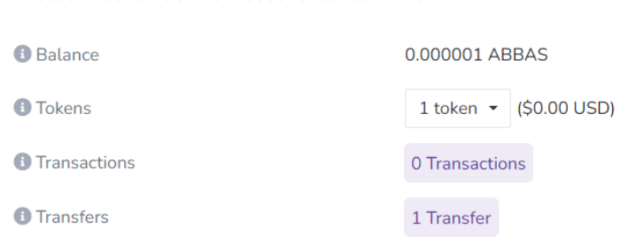

# Memo Megrez Chain information 

  RPC: https://chain.metamemo.one:8501/
  ChainToken：cMEMO
  ID: 985
  Explore: https://scan.metamemo.one:8080/

Memo-ERC20 Address：0xeB8eec5a2dBf6e6f4Cc542ad31CCe706f8f80419

# How to check the balance

## Method 1：

Enter the product chain browser: https://scan.metamemo.one:8080/

&nbsp;
You can check the account balance by pasting the wallet address into the search box in the upper right corner. There are two account balances:

&nbsp;
Balance: Product chain token (cMEMO) balance, used for transaction overhead when starting a node

&nbsp;
Tokens: Major Token (MEMO) balance, used to pay for storage services and staking.

## Method 2:

Refer to WIKI and enter the container, and then run the command line to view all the information of the node, including account balance.

&nbsp;

1.After the account is initialized, start the node and enter the container. Run the command line "mefs-user info" or "mefs-provider info" to check the account balance.

&nbsp;

2.If the account has been started, and then the computer has been shutted down, Docker, or "Windows PowerShell" was been closed, you need to restart MEMO again to check the balance. Specifically, you need to open Docker first, then run the command line " docker start mefs-user" using Windows Powershell to start, and then enter the container to check it through the command line"mefs-user info" or "mefs-provider info".
