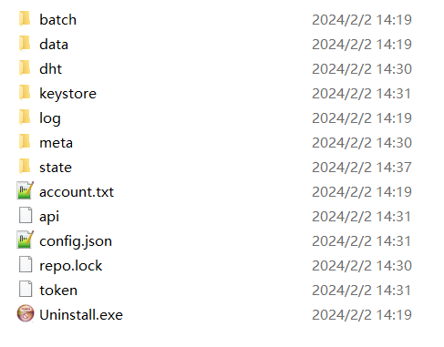
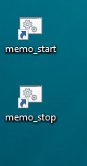

# In Windows OS

&nbsp; 

## Step 1 Download install package

Download url:

https://github.com/memoio/go-mefs-release/releases/

&nbsp;

## Step 2 Unzip package

Unzip mefs-user-install.zip

​

​&nbsp;

## Step 3 install

Enter "mefs-user-install" file folder, double click register.exe for regestering user.

​

​&nbsp;

## Step 4 Check account address

After successfully registered user, you can see the content of installation directory as follows:

​

Open "account.txt." It will contain your wallet address and created password as shown below.

Contact the Memolabs team to recharge your wallet with some tokens before proceeding to the next stage.

​

​&nbsp;

## Step 5 Top UP

Starting node needs both the Memo and cMemo token.

To get the cMemo token, there is one faucet, https://faucet.metamemo.one/

This is the MemoChain information.

Memochain information

Chain RPC: https://chain.metamemo.one:8501/

Currency name: CMEMO

Chain ID: 985

Chain browser: https://scan.metamemo.one:8080/

To get Memo Tokens for your wallet, you can transfer some Memo Tokens
from other wallet address which has enough Memo Tokens. The user needs minimum 1 Memo Tokens.

Join our discussing with Slack Link:

https://join.slack.com/t/memo-nru9073/shared_invite/zt-sruhyryo-suc689Nza3z8boa4JkaLqw

**If you want to check the account balance,Please refer to this link**

[How to checking the account balance]()

​&nbsp;

## Step 6 Start user

When your installation completed, the content of installation folder is as follows:

​

Mmeanwhile there are 2 more icons appeared on your desktop.

​

Run 'memo_start' icon on desktop to start user.

The running window will show that user node is starting, and data is being synchronized. This will take about 5 hours to complete, please be patient. 

​

&nbsp;

## Step 7 Check process

Now you can see two "mefs-user.exe" in the task manager shows the user node and gateway is running.

​

​&nbsp;

## Step 8 View Webui to work with User Node

Open URL http://127.0.0.1:9090 in your web browser to use user WebUI, and open the account.txt in the memouser folder to view your login imformation

​

​&nbsp;

### Create bucket

Caution: If this is the first run of your User node, you need to wait about 10~20 minutes for node to complete synchronization. If sync is not complete yet, you will get a "lfs service is read only" error.

After that you can begin create bucket.

​

​&nbsp;

### Upload file

Caution: When a new bucket is created, it needs about 2 minutes to be confirmed. So wait a moment before you start to upload files into a new bucket.

​

​

​&nbsp; 

### Download file

&nbsp; 

## Step 9 Stop User

You can stop user node with following 2 methods. But this just closes node service, the gateway service is not closed, you have to manually close it in the task manager for now.

