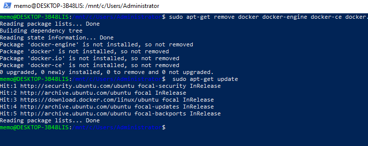
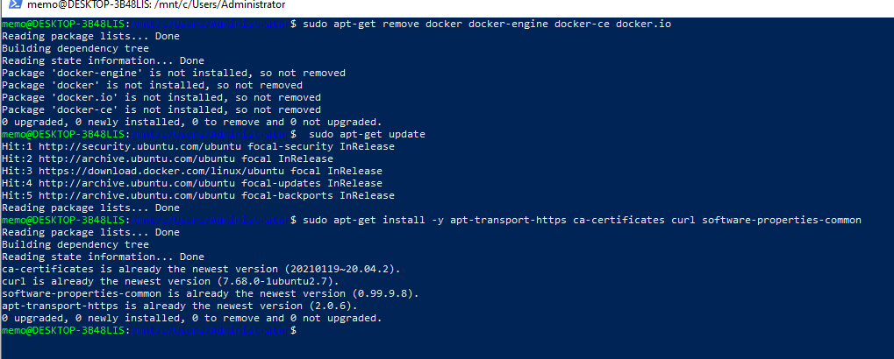
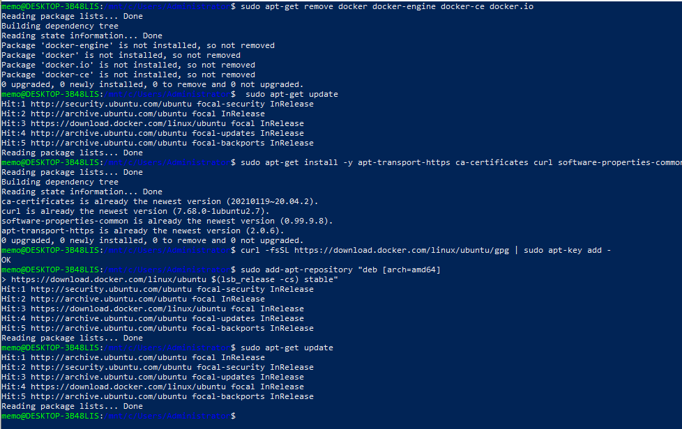
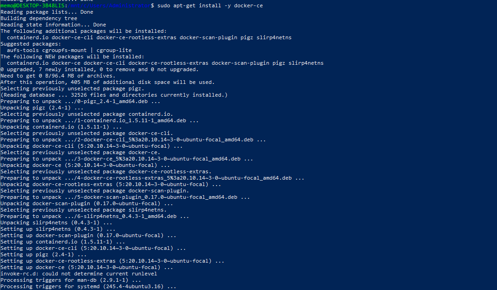
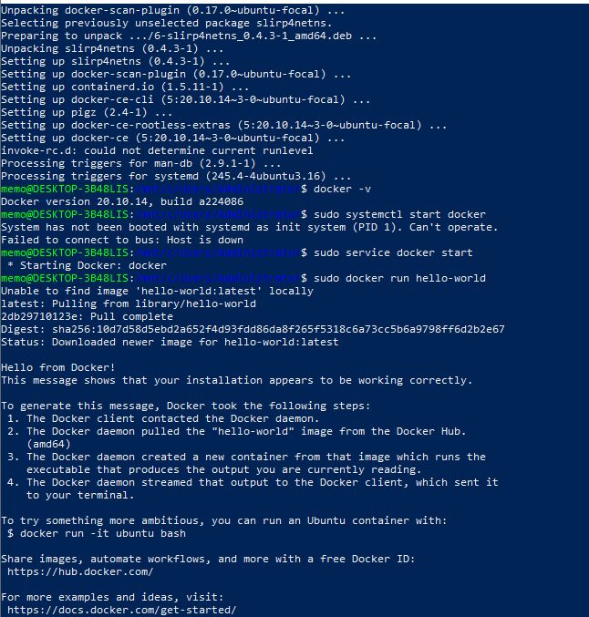
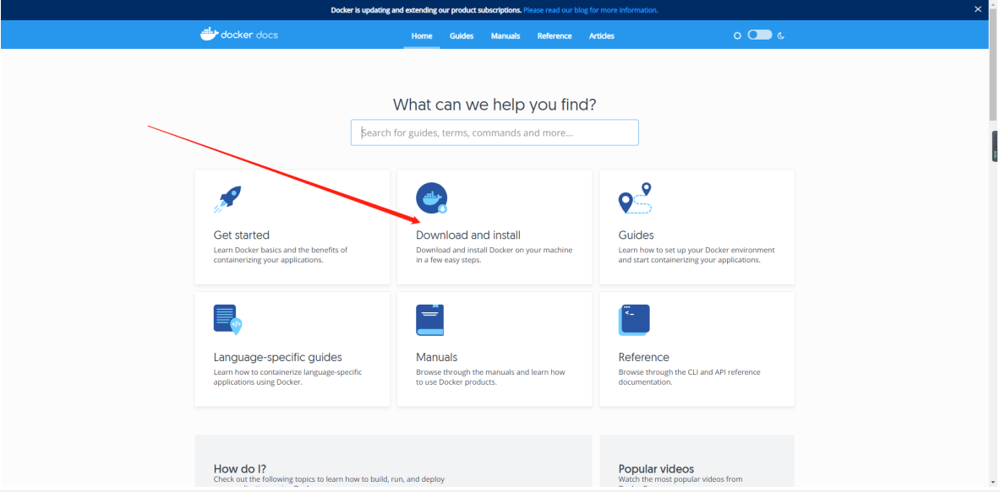
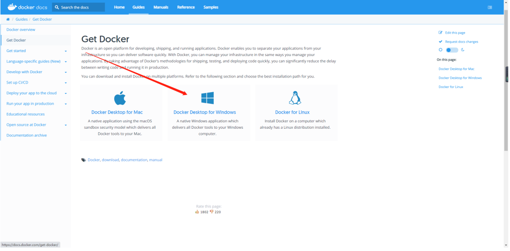
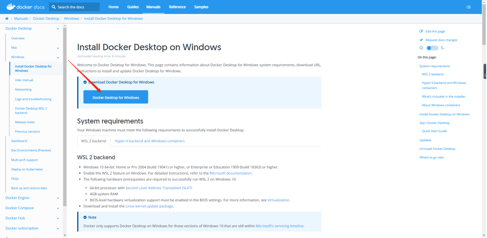
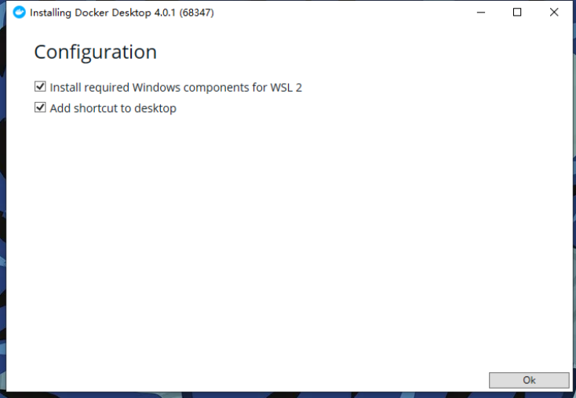
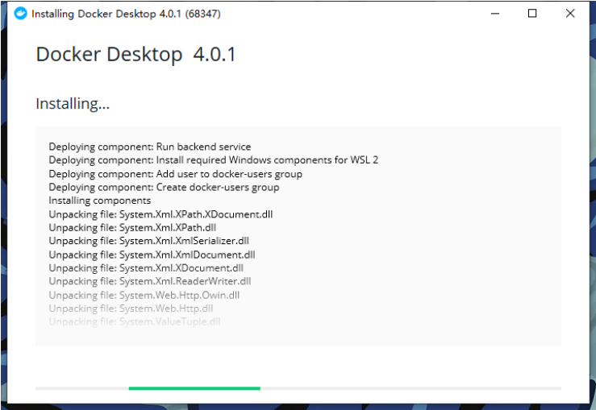

# For Linux

Before starting the memo, you must install docker.

&nbsp; 

**Docker:** [Install on Linux](https://docs.docker.com/desktop/install/linux-install/)

**How to install Docker in Linux(Ubuntu)：**

**1、Update apt package index**

```shell
sudo apt-get update
```




&nbsp;

**2、Install the following packages to enable apt to use the repository over HTTPS**

```shell
sudo apt-get install -y apt-transport-https ca-certificates curl software-properties-common
```

​

​&nbsp;

**3、Add the GPG key of Docker official**

```shell
curl -fsSL https://download.docker.com/linux/ubuntu/gpg | sudo apt-key add
```

**4、Run the following command line to set up the stable repository**

```shell
sudo add-apt-repository "deb [arch=amd64] https://download.docker.com/linux/ubuntu $(lsb_release -cs) stable"
```

​

​&nbsp;

**5、 Update the apt package index again**

```shell
sudo apt-get update
```



&nbsp; 

**6、 Install the latest version of Docker CE**

```shell
sudo apt-get install -y docker-ce
```



&nbsp; 

**7、 Verify whether the installation is successful**

Check the version of docker installed

```shell
docker -v
```

Start docker and pull hello-world to verify whether the installation is successful

```shell
sudo service docker start
```

Since sudo access is required to use docker, enter the password here and it will be started successfully.

Next, run the following command line

```shell
sudo docker run hello-world
```

You can see the container being downloaded from the remote for testing： Pulling from library/hello-world

When you see the message： Hello from Docker! It means the docker is successfully installed.


# For Windows

Before starting the memo, you must install docker.

&nbsp; 

**Windows install Docker：**

1、[Docker official website](https://www.docker.com/)

2、Download docker for windows








&nbsp; 

Wait for the download to complete.

&nbsp; 

Double click to install.



&nbsp; 

Wait, finish.



&nbsp; 

After the installation is complete, you will be prompted to restart the computer.

 &nbsp;

Double-click the icon to start docker.


# WSL Installation in Windows

If you are using Windows OS, you should install docker first, then install wsl to emulate a linux OS.

Install Docker in Windows
Just download and install the docker application in Windows.

Download link: https://www.docker.com/

Install wsl

Using ubuntu 20.04 as an example.
Open the starting menu and run microsoft store.
Search for wsl, click Ubuntu 20.04 in the results to install.

Switch wsl1 to wsl2

Right click the start memu and open powershell(administrator), run:

```shell
wsl --set-version Ubuntu-20.04 2
```

Confirm the wsl version is switched to version 2

```shell
wsl -l -v
```

Run Ubuntu 20.04 from start memu to enter an emulated Ubuntu 20.04 and continue.